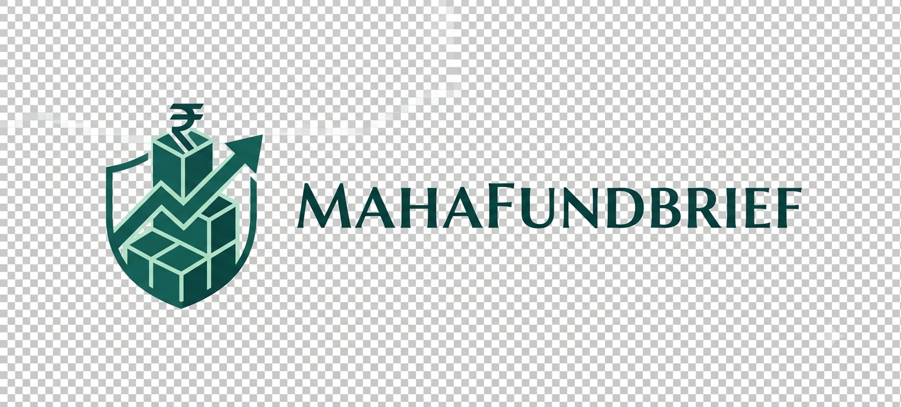
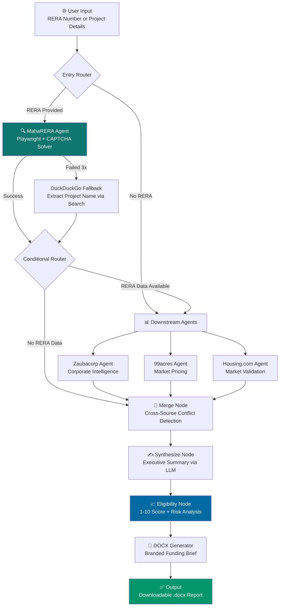

<div align="center">
  
  <h1>MahaFund Brief</h1>
  <p><strong>Agentic AI Platform for Automated Real Estate Due Diligence & Funding Eligibility</strong></p>

  <p>
    
    
    
    
    
    
    
    
  </p>

  <p>
    <a href="https://mahafundbrief.qd.je"><strong>🌐 Live Site</strong></a> ·
    <a href="https://arisetoascend.com"><strong>🏢 Agency: Arise To Ascend</strong></a>
  </p>
</div>

<br/>

> **MahaFund Brief** is an end-to-end agentic AI system that replaces hours of manual analyst work by orchestrating a pipeline of autonomous agents. It scrapes the MahaRERA government portal (solving CAPTCHAs with LLM vision), downloads and visually parses financial PDFs using Gemini multimodal, cross-references market data from 3 additional sources, and generates a scored, investor-ready **Funding Eligibility Brief** in under 2 minutes.

---

## 📊 Key Metrics

| Metric | Value |
|--------|-------|
| **RERA Documents Downloaded** | Up to 6 per project (Title Report, CA Certificates, Layout Plans, etc.) |
| **Data Sources Cross-Referenced** | 4 (MahaRERA, Zaubacorp, 99acres, Housing.com) |
| **Report Generation Time** | ~2 minutes end-to-end |
| **Financial Extraction Method** | Gemini 1.5 Pro Vision (multimodal PDF → structured JSON) |
| **Eligibility Scoring** | AI-generated 1-10 score with strengths, risks & conditions |
| **Output Format** | Branded `.docx` with clickable document links |

---

## 🏗️ System Architecture

The platform is built as a **stateful directed acyclic graph (DAG)** using LangGraph. Each node in the graph is a specialized agent that executes autonomously, with conditional routing based on upstream results. This is not a simple chain — it handles failures, fallbacks, and cross-agent data dependencies.



### Agent Breakdown

| Agent | Technology | What It Does |
|-------|-----------|--------------|
| **MahaRERA Agent** | Playwright + Gemini Vision | Navigates the government portal, solves image CAPTCHAs via LLM, downloads up to 6 key legal/financial PDFs, extracts structured data using multimodal vision |
| **Zaubacorp Agent** | httpx + BeautifulSoup | Scrapes corporate registry data — directors, paid-up capital, business activity |
| **99acres Agent** | httpx + BeautifulSoup | Extracts project pricing, configurations, location advantages, and possession dates |
| **Housing.com Agent** | httpx + BeautifulSoup | Cross-validates market data with an independent real estate portal |
| **Merge Node** | Python | Aggregates all agent outputs, detects cross-source conflicts (e.g., different completion dates) |
| **Eligibility Node** | Groq (LPU) | AI-generated 1-10 funding score with structured risk/strength/condition analysis |

---

## 🧠 Core AI Engineering

### 1. Multimodal Document Intelligence (Gemini 1.5 Pro Vision)

Traditional text extraction (PyMuPDF, pdfplumber) fails catastrophically on scanned government PDFs with complex table layouts. Instead, we pass **raw PDF bytes** directly to Gemini 1.5 Pro as a vision task:

```python
# Pass raw PDF bytes to Gemini for visual table extraction
contents = [
    types.Part.from_bytes(data=pdf_bytes, mime_type="application/pdf"),
    f"Extract all financial data from this CA Certificate..."
]
response = client.models.generate_content(model="gemini-2.5-flash", contents=contents)
```

This approach achieves **near-perfect extraction** of tabular financial data (Land Cost, Construction Cost, Revenue, Deposits) from documents that defeat conventional parsers.

### 2. LLM-Powered CAPTCHA Solving

The MahaRERA portal gates every project lookup behind a dynamic image CAPTCHA. Our agent:
1. Intercepts the CAPTCHA `<canvas>` element via Playwright
2. Takes a screenshot of the isolated CAPTCHA region
3. Sends the image to Gemini Vision for character recognition
4. Inputs the decoded text and submits programmatically
5. Retries up to 3 times with fresh CAPTCHAs on failure

### 3. Stateful Agent Orchestration (LangGraph)

The pipeline uses LangGraph's `StateGraph` with **conditional edges** — not a simple sequential chain. Key design decisions:
- **Conditional entry:** If no RERA number is provided, the MahaRERA agent is skipped entirely and the pipeline routes directly to market agents.
- **Failure isolation:** If MahaRERA fails after 3 retries, a DuckDuckGo fallback extracts the project name from search snippets, so downstream agents can still operate.
- **Bounded context propagation:** Downstream agents receive only the exact `project_name`, `promoter_name`, and `location` from the upstream MahaRERA result — tightly scoped to prevent hallucination-driven searches.

### 4. Multi-Key Load Balancing & Retry Strategy

The LLM utility layer implements a **round-robin key pool** with exponential backoff:
- Multiple API keys are loaded from environment variables
- On rate-limit (429/503), the system rotates to a different key and retries with increasing delays
- This ensures resilience during high-demand periods without service interruption

---

## 🚀 Quick Start

### Prerequisites
- Python 3.10+
- Docker (optional)
- API Keys: [Google Gemini](https://ai.google.dev/) & [Groq](https://console.groq.com/)

### Local Development

```bash
# Clone
git clone https://github.com/contactaryanshukla14-lgtm/MahaFund-Brief.git
cd MahaFund-Brief

# Install dependencies
pip install -r requirements.txt
playwright install chromium

# Configure environment
cp .env.example .env
# Edit .env with your API keys

# Run
uvicorn src.server:app --reload --port 8000
```

Open `http://localhost:8000` — the full UI + API is served from a single process.

---

## 🐳 Docker (Production)

```bash
docker build -t mahafund-brief .
docker run -p 8000:8000 --env-file .env mahafund-brief
```

The Docker image bundles Chromium for headless scraping. Ready for deployment to **AWS ECS**, **AWS AppRunner**, or any container orchestrator.

---

## 📁 Project Structure

```
MahaFund-Brief/
├── frontend/               # Static SPA (HTML/CSS/JS)
│   ├── index.html          # Landing page with dual-mode form
│   ├── style.css           # Design system (Swiss/Minimalist)
│   ├── app.js              # API integration & progress UI
│   └── assets/             # Logo and brand assets
├── src/
│   ├── agents/             # Autonomous scraping agents
│   │   ├── maharera.py     # MahaRERA portal + CAPTCHA + PDF extraction
│   │   ├── zaubacorp.py    # Corporate intelligence agent
│   │   ├── ninety_nine_acres.py
│   │   └── housing.py
│   ├── graph/              # LangGraph pipeline
│   │   ├── pipeline.py     # DAG definition with conditional edges
│   │   ├── nodes.py        # Node implementations (merge, synthesize, score)
│   │   └── state.py        # Typed state schema
│   ├── output/             # Report generation
│   │   └── docx_generator.py
│   ├── utils/              # LLM clients, logging, retry logic
│   └── server.py           # FastAPI application
├── Dockerfile              # Production container (includes Chromium)
├── requirements.txt
└── .env.example
```

---

<div align="center">
  <br/>
  
  <br/><br/>
  <p><strong>Made by Aaryan Shukla</strong> | Built for <a href="https://arisetoascend.com"><strong>Arise To Ascend</strong></a> · Powering the future of Real Estate Finance with AI.</p>
  <p><sub>Data sourced from MahaRERA, Zaubacorp, 99acres, Housing.com · Reports are AI-generated and should be independently verified.</sub></p>
</div>
